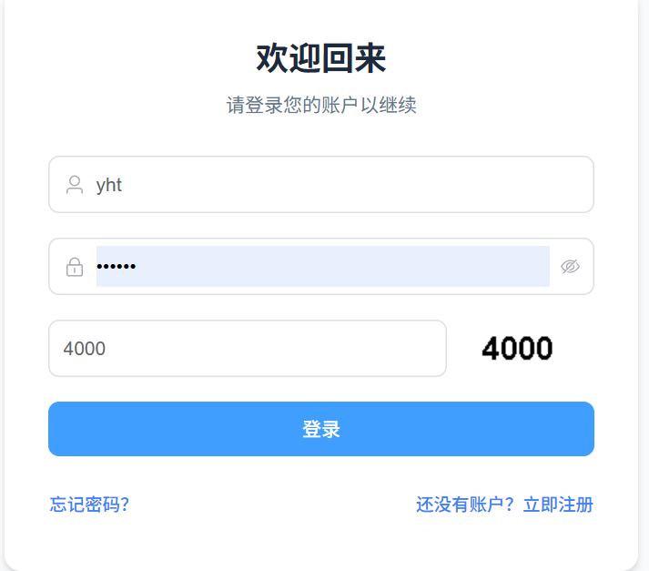
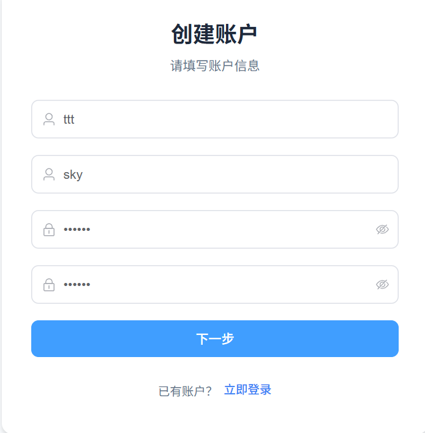
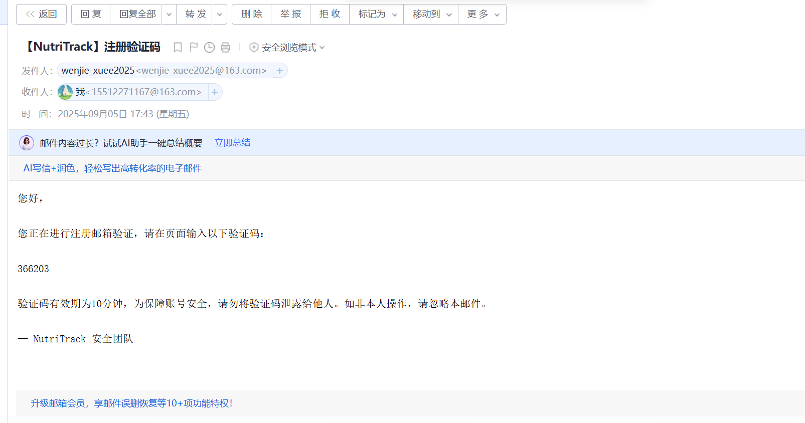
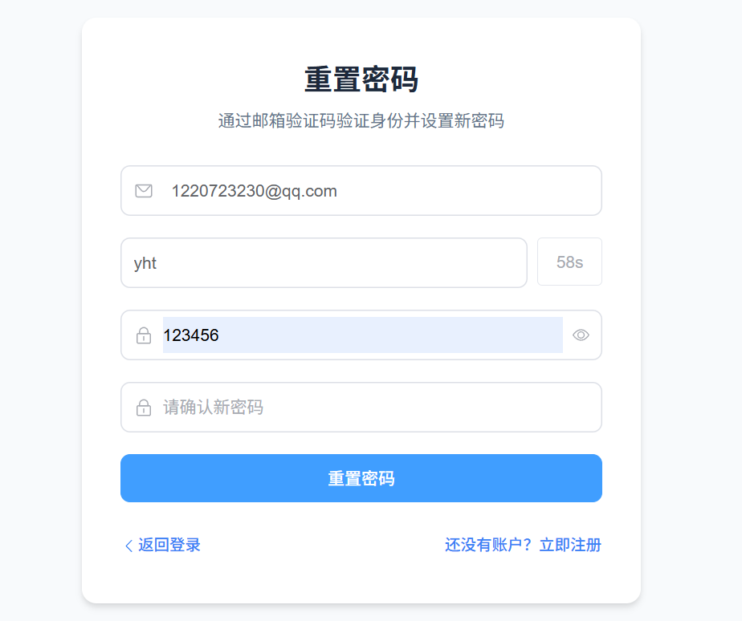
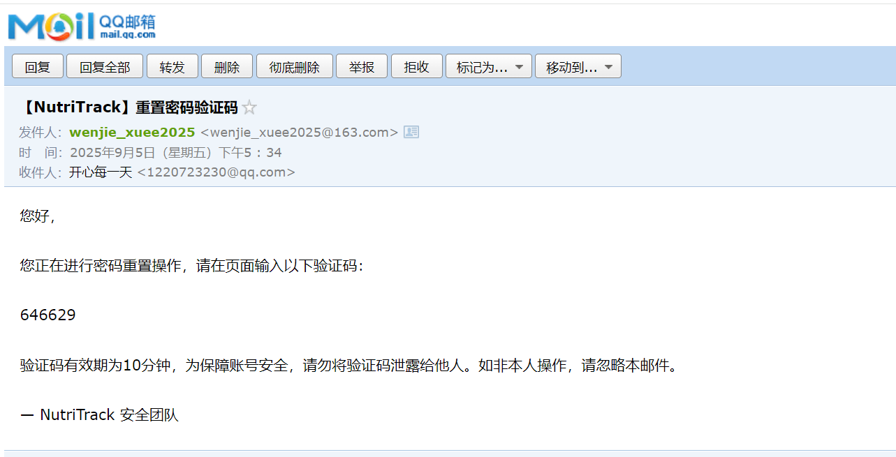
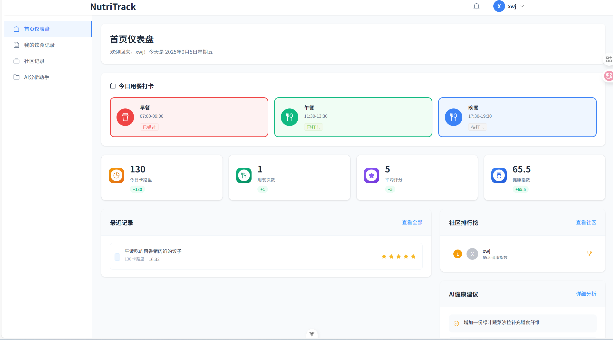
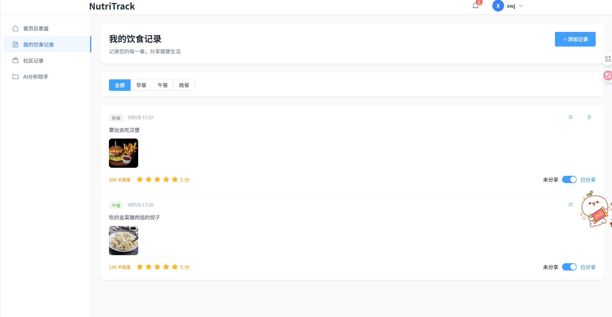
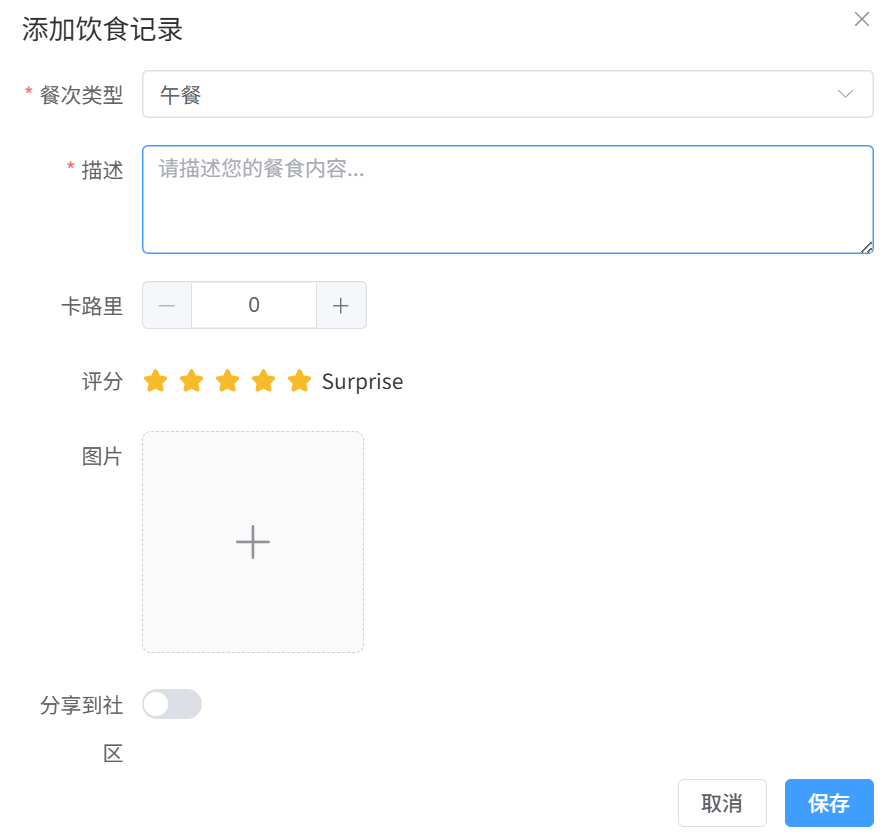
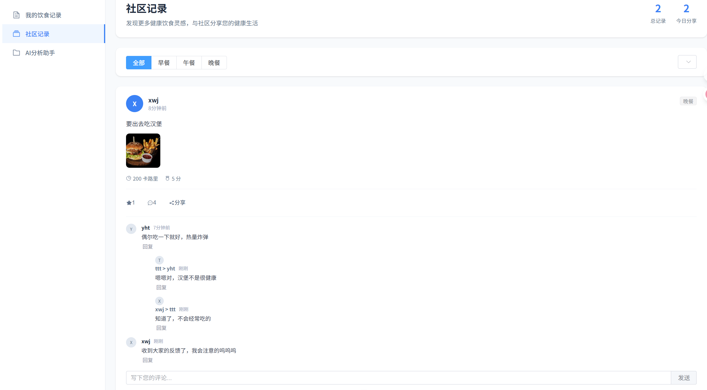
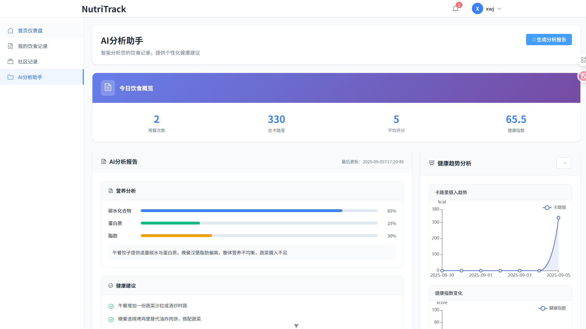

# NutriTrack - 营养追踪与健康管理平台

一个基于 **Vue3 + Element Plus + Pinia + Axios**（前端）和 **Spring Boot + Spring Security + JWT + MyBatis-Plus**（后端）实现的营养追踪与健康管理平台。

---

## 🌟 项目简介

NutriTrack 是一款专注于个人饮食记录与健康管理的应用，用户可以记录每日三餐情况，并选择是否分享到社区。平台提供 AI 分析功能，评估饮食健康度，并支持社区互动功能。

### 核心功能

- ✅ 用户注册与登录（JWT Token 认证）
- ✅ 忘记密码与密码重置
- ✅ 个人饮食记录管理（文字+图片）
- ✅ 社区分享与互动（点赞、评论）
- ✅ AI 饮食健康分析与建议
- ✅ 个人仪表盘概览
- ✅ 通知提醒系统

---

## 🚀 功能模块

### 1. 用户认证系统
完整的用户注册、登录、忘记密码流程，采用 JWT 进行身份验证，保障系统安全。

### 2. 个人饮食记录
- 记录每日三餐（早餐、午餐、晚餐）
- 支持文字描述与图片上传
- 可选择是否分享到社区
- 个人记录分类查看与管理

### 3. AI 健康分析
- 基于用户饮食记录提供健康评分
- 生成营养分析报告
- 提供个性化饮食改进建议
- AI 营养师助手对话功能

### 4. 社区互动
- 查看其他用户分享的饮食记录
- 点赞与评论互动
- 社区健康排行榜
- 图片预览功能

### 5. 个人仪表盘
- 统计近期饮食记录情况
- 显示健康评分趋势
- 重要通知与提醒
- 快捷操作入口

### 6. 通知系统
- 系统通知
- 社区互动提醒
- 用餐提醒功能

---

## 🛠 技术栈

### 前端
- [Vue3](https://vuejs.org/) - 渐进式 JavaScript 框架
- [Vue Router](https://router.vuejs.org/) - 路由管理
- [Pinia](https://pinia.vuejs.org/) - 状态管理
- [Element Plus](https://element-plus.org/) - UI 组件库
- [Axios](https://axios-http.com/) - HTTP 请求库
- [Vite](https://vitejs.dev/) - 前端构建工具

### 后端
- [Spring Boot 3](https://spring.io/projects/spring-boot) - 后端框架
- [Spring Security](https://spring.io/projects/spring-security) - 安全认证
- [JWT (jjwt)](https://github.com/jwtk/jjwt) - Token 鉴权
- [MyBatis-Plus](https://baomidou.com/) - ORM 框架
- [MySQL](https://www.mysql.com/) - 数据库

---

## 📂 项目结构

```
NutriTrack
├── backend # Spring Boot 后端 
│ ├── src/main/java/com/myproject 
│ │ ├── config # JWT & Security 配置 
│ │ ├── controller # 控制层 
│ │ ├── dto # 数据传输对象 
│ │ ├── entity # 实体类 
│ │ ├── enums # 枚举类型 
│ │ ├── exception # 异常处理 
│ │ ├── mapper # MyBatis-Plus Mapper 
│ │ ├── result # 统一响应结果 
│ │ ├── service # 业务逻辑层 
│ │ ├── utils # 工具类 (JWT工具等) 
│ │ └── vo # 视图对象 
│ └── resources 
│ └── application.yml # 配置文件 
│ ├── frontend # Vue3 前端 
│ ├── src 
│ │ ├── api # axios 封装 & 接口请求 
│ │ ├── store # pinia store 
│ │ ├── views # 页面组件 
│ │ │ ├── AIAnalysis.vue # AI分析页面 
│ │ │ ├── Community.vue # 社区页面 
│ │ │ ├── Dashboard.vue # 仪表盘页面 
│ │ │ ├── MyMeals.vue # 个人饮食记录页面 
│ │ │ ├── Login.vue # 登录页面 
│ │ │ ├── Register.vue # 注册页面 
│ │ │ └── ... # 其他页面 
│ │ ├── router # vue-router 配置 
│ │ └── utils # 工具类 
│ └── vite.config.js # Vite 配置 
└── README.md
```
----

## 🗄 数据库设计

项目包含以下核心数据表：

- `users` - 用户信息表
- `meal_records` - 饮食记录表
- `meal_images` - 饮食图片表
- `daily_diet_analysis` - 每日饮食分析表
- `record_likes` - 记录点赞表
- `record_comments` - 记录评论表
- `notifications` - 通知表

---

## ⚡ 快速开始

### 环境准备
- Java 21
- Node.js 16+
- MySQL 5.7+
- Maven 3.6+

### 后端运行

1. 修改 `backend/src/main/resources/application.yml` 数据库配置：
   ```yml
   spring:
     datasource:
       url: jdbc:mysql://localhost:3306/nutritrack?useSSL=false&serverTimezone=UTC
       username: root
       password: your_password
   ```
2. 在MySQL客户端运行项目中给的[sql文件](NutriTrack.sql)
3. 启动后端服务：
   ```bash 
   cd backend 
   mvn spring-boot:run
   ````

### 前端运行
1. 安装依赖
   ```bash
   cd frontend
   npm install
   ```
2. 运行前端
   ```bash
   npm run dev
   ```
3. 访问应用：http://localhost:5173

---

## 📄 API 文档

后端集成 Swagger UI，可访问以下地址查看 API 文档：
- http://localhost:8080/swagger-ui.html

---

## 🔥 部署说明

### 环境要求

在部署NutriTrack应用之前，需要确保服务器满足以下环境要求：

- Java 21 或更高版本
- Node.js 16+ 或更高版本
- MySQL 5.7+ 或更高版本
- Maven 3.6+ 或更高版本

### 快速启动应用
- 运行数据库文件
- 进入到jar包所在文件夹
  ```
  java -jar nutritrack.jar --spring.datasource.username=root --spring.datasource.password=yourpassword --spring.data.redis.port=yourport
  ```
  如果配置和现在yml文件一致可不用修改
- 浏览器直接访问http://localhost:8080 即可进入应用 

### 后端部署步骤

1. **数据库配置**
   - 创建数据库：在MySQL中执行项目中的`NutriTrack.sql`文件
   - 修改数据库配置：更新 `backend/src/main/resources/application.yml` 中的数据库连接信息
     ```yaml
     spring:
       datasource:
         url: jdbc:mysql://localhost:3306/nutritrack?useSSL=false&serverTimezone=UTC
         username: your_username
         password: your_password
     ```

2. **打包后端应用**
   ```bash
   cd backend
   mvn clean package
   ```

   打包完成后，会在`target`目录下生成`backend-0.0.1-SNAPSHOT.jar`文件。

3. **运行后端服务**
   ```bash
   java -jar target/backend-0.0.1-SNAPSHOT.jar
   ```
   

### 前端部署步骤

1. **构建前端项目**
   ```bash
   cd frontend
   npm install
   npm run build
   ```

   构建完成后，会在`dist`目录下生成所有静态资源文件。

2. **部署前端资源**
   - 将`dist`目录下的所有文件复制到Nginx的静态资源目录（通常是`/usr/share/nginx/html`）
   - 配置Nginx反向代理，使API请求转发到后端服务

3. **Nginx配置示例**
   ```nginx
   server {
       listen 80;
       server_name your_domain.com;
       
       location / {
           root /usr/share/nginx/html;
           index index.html;
           try_files $uri $uri/ /index.html;
       }
       
       location /api/ {
           proxy_pass http://localhost:8080/;
           proxy_set_header Host $host;
           proxy_set_header X-Real-IP $remote_addr;
           proxy_set_header X-Forwarded-For $proxy_add_x_forwarded_for;
       }
   }
   ```


### 配置说明

1. **JWT密钥配置**
   在`application.yml`中配置JWT密钥：
   ```yaml
   jwt:
     secret: your_jwt_secret_key
     expiration: 86400000
   ```

## 🤝 声明

项目为2025年南开大学软件学院暑期实训项目，详细开发过程记录可见[NKU内部飞书文档](https://nankai.feishu.cn/wiki/RGetwpj7iisN5RkxtGQc6KgTnBc)🤗🤗

------

## 🧩项目截图

<div align="center">
  
  <p style="margin:5px 0;">图1 登录</p>
</div>

<div align="center">
  
  <p style="margin:5px 0;">图2 注册</p>
</div>


<div align="center">
  
  <p style="margin:5px 0;">图3 邮箱注册</p>
</div>
<div align="center">
  
  <p style="margin:5px 0;">图4 重置密码</p>
</div>


<div align="center">
  
  <p style="margin:5px 0;">图5 邮箱重置密码</p>
</div>

<div align="center">
  
  <p style="margin:5px 0;">图6 仪表盘</p>
</div>
<div align="center">
  
  <p style="margin:5px 0;">图7 我的饮食记录</p>
</div>

<div align="center">
  
  <p style="margin:5px 0;">图8 添加饮食记录</p>
</div>


<div align="center">
  
  <p style="margin:5px 0;">图9 社区</p>
</div>

<div align="center">
  
  <p style="margin:5px 0;">图10 AI分析</p>
</div>
